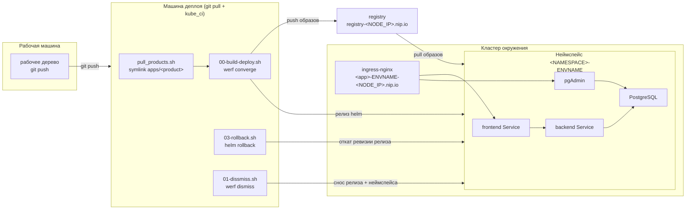
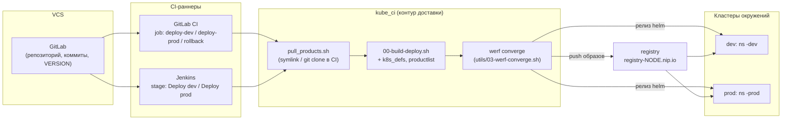

# werf_ci_demo

Демонстрационный репозиторий связки **kube_ci** (bash-оркестрация сборки и
деплоя через [werf](https://werf.io)) с набором разнородных демо-приложений.

Назначение -- показать, как разнородные продукты (разные стеки) собираются и
деплоятся единым CI-контуром по общему контракту в два окружения
(**dev / prod**), и как выполняются три базовые операции:
**публикация, откат, очистка**.

Кластеры считаются уже развёрнутыми. ВРЕМЕННО оба окружения указывают на
один физический preprod-кластер; продукты различаются неймспейсом.

## Состав

| Каталог | Назначение |
|---|---|
| `apps/` | демо-продукты: исходники, `Dockerfile`, `werf.yaml`, `.helm/`-чарты |
| `kube_ci/` | адаптированная копия оркестрации werf-деплоя |
| `docs/` | документация и runbook'и |

### Демо-продукты (`apps/`)

| Продукт | Фронт | Бек | Хранилище |
|---|---|---|---|
| `app1-java-react` | React | Spring Boot (Java) | PostgreSQL + pgAdmin |
| `app2-python-angular` | Angular | FastAPI (Python) | PostgreSQL + pgAdmin |

Разные стеки специально: один CI-контур обслуживает оба продукта через единый
контракт `.helm/def.sh` (см. [apps/README.md](apps/README.md)).

## Базовые операции

Все операции запускаются из каталога окружения (`kube_ci/dev/` или
`kube_ci/prod/`):

| Операция | Команда |
|---|---|
| Публикация (werf converge) | `./pull_products.sh && ./00-build-deploy.sh` |
| Откат (dismiss namespace) | `./01-dissmiss.sh <product>` |
| Очистка (сброс кеша сборки) | `./02-purge-stages.sh` |

Полный сценарий -- [docs/runbooks/deploy.md](docs/runbooks/deploy.md).
Требования к кластеру -- [docs/kubernetes/requirements.md](docs/kubernetes/requirements.md).

## Автономно и в составе большого CI/CD

Один и тот же набор `kube_ci` работает в двух режимах **без переделки**:

- **Автономно** -- запуск вручную из каталога окружения (`kube_ci/<env>/`): те
  же команды публикации, отката и очистки. Нужны рабочая машина или сервер
  деплоя с доступом к кластеру и реестру -- ни CI-системы, ни git-сервера не
  требуется.
- **В составе конвейера** -- GitLab CI, Jenkins или другой раннер вызывает те же
  `00-build-deploy.sh` / `03-rollback.sh` / `01-dissmiss.sh` /
  `02-purge-stages.sh`. Пайплайн становится **тонкой обёрткой**, а не
  переписанной логикой: stage'ы маппятся на эти же скрипты.

Граница между «снаружи» и контуром -- переменные окружения (`KUBECONFIG`,
`KUBECONTEXT`, `K8S_NODE_IP`/`REGISTRY`, `WERF_SECRET_KEY`) и сами скрипты.
Поэтому переход от ручного прогона к промышленному конвейеру не требует менять
ни продукты, ни оркестрацию -- меняется только обвязка доступа на стороне
раннера. Те же скрипты масштабируются от одной команды в терминале до
многостадийного пайплайна с промоутом dev -> prod, откатом и очисткой по
расписанию.

Оба режима наглядно.

**Автономный режим** -- рабочая машина пушит код, сервер деплоя тянет его
(`git pull`) и прогоняет `kube_ci` (`werf converge`, откат, снос) в неймспейс
`<NAMESPACE>-<ENVNAME>` кластера. CI-система не нужна.

**В составе конвейера** -- перед тем же `kube_ci` встают VCS и CI-раннеры
(GitLab CI / Jenkins); контур остаётся той же тонкой обёрткой, меняется лишь
способ запуска и доступ раннера.

Подключение по системам -- [docs/integrations/](docs/integrations/README.md)
(GitLab CI, Jenkins, метрики DORA).

## Почему werf и когда такой подход оправдан

Доставка в Kubernetes -- это собрать образ и применить релиз. Большинство
инструментов закрывают только одну половину, а стык остаётся на инженере или на
склеивающих скриптах. werf покрывает обе из одного git-состояния: сборка и
релиз идут одним `converge` и видят одни и те же данные.

| Инструмент | Что закрывает | Граница с werf |
|---|---|---|
| `docker build` + `kubectl apply` | сборка и применение вручную | werf сам синхронизирует теги и пересборку стадий -- без склеивающих скриптов |
| Helm | деплой: чарт, релиз, откат | werf достраивает сборку и связывает образ с рендером; чарт остаётся helm-совместимым |
| Helmfile | оркестрация множества чартов | другая ось: werf сшивает сборку+релиз одного продукта (набор оркеструет сам `kube_ci`) |
| Kustomize | патчи манифестов без шаблонов | werf перекрывает рендер и добавляет сборку сверху |
| Skaffold | сборка+деплой для inner-loop | werf -- под воспроизводимую CI/prod-доставку по git-состоянию |
| ArgoCD / Flux | pull-GitOps, постоянный reconcile | werf -- imperative push: проще завести, но не следит за дрейфом; может быть сборщиком и в GitOps |

**Плюсы решения демо**

- Один `werf converge` = сборка + публикация + релиз: нет ручной синхронизации
  тегов и склеивающих скриптов.
- Воспроизводимость от git-состояния (giterminism): один коммит -- одна
  выкатка; кеш по стадиям ускоряет повторные сборки.
- Чарт helm-совместим -- наработки Helm переносятся; `converge` идемпотентна и
  атомарна, что упрощает базовые операции.
- Разнородные продукты (Java/React и Python/Angular) идут одним контуром через
  общий контракт `.helm/def.sh` -- добавить продукт можно без правок `kube_ci`.
- Три операции -- тонкие bash-обёртки над werf; push-модель проще завести и
  отлаживать, без оператора в кластере.

**Когда оправдан**

- Да: ценна сшивка сборки и релиза из одного git-состояния; нужно ставить
  разнородные продукты единым контуром; достаточно push-модели без оператора в
  кластере.
- Избыточен: образы собирает отдельный отлаженный пайплайн, нужен только деплой
  (-> чистый Helm); нужен непрерывный reconcile и аудит через git (-> GitOps
  ArgoCD/Flux); важна горячая inner-loop разработка (-> Skaffold).

Полный разбор по каждому инструменту --
[docs/concepts/werf-vs-alternatives.md](docs/concepts/werf-vs-alternatives.md).

## Документация

Документация разбита на тематические разделы; индекс и путь чтения -- в
[docs/README.md](docs/README.md).

| Раздел | Содержимое |
|---|---|
| [docs/concepts/](docs/concepts/README.md) | werf, сравнение с альтернативами, модель доставки, компромиссы |
| [docs/kubernetes/](docs/kubernetes/README.md) | требования к кластеру, спецификации объектов, ingress |
| [docs/products/](docs/products/README.md) | состав двух продуктов, PostgreSQL, pgAdmin |
| [docs/delivery/](docs/delivery/README.md) | окружения dev/prod, операции kube_ci, секреты, версии |
| [docs/integrations/](docs/integrations/README.md) | GitLab CI, Jenkins, метрики DORA |
| [docs/runbooks/](docs/runbooks/README.md) | пошаговые сценарии эксплуатации |

Справочные материалы: [docs/glossary.md](docs/glossary.md) -- термины контура,
[docs/resources.md](docs/resources.md) -- внешние ресурсы.

## Состояние

Репозиторий содержит работающую оркестрацию и оба продукта целиком: исходники,
`Dockerfile`/`Dockerfile.dev`, `werf.yaml`, `.helm/`-чарты (ingress, pgAdmin,
db-init-configmap, backend/frontend в dev- и prod-формах, secret), файлы версии
и `set-version.sh`. Демонстрационной остаётся только бизнес-логика фронта и
бэкенда -- продукты служат носителями стека и контракта. Вне скоупа демо --
разворачивание самих кластеров (они считаются готовыми) и реальная продуктовая
функциональность.
