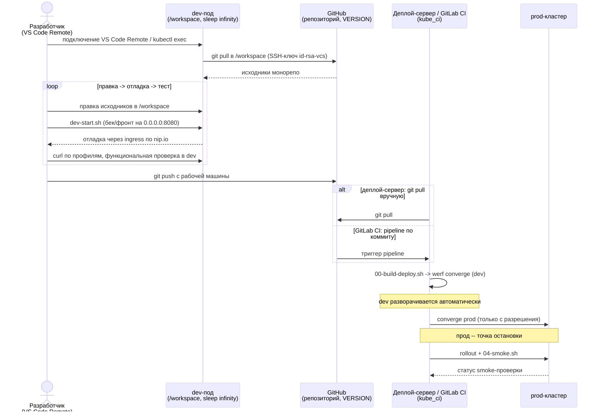

# Типовой цикл работы в dev-поде

dev-под -- долгоживущая песочница в кластере, в которой разработчик правит код
через VS Code Remote, поднимает dev-сервер и проверяет правки до того, как они
уйдут в общий контур доставки. Статья собирает разрозненные шаги в один связный
цикл: от подключения к поду до выката в prod. Устройство самой dev-схемы (что
рендерит окружение, init-контейнер, `dev-start.sh`) описывает
[Разработка внутри кластера](dev-in-cluster.md); persistent-volume'ы пода --
[Кеши и persistent-volume'ы dev-сред](dev-caches-and-volumes.md); поток выкатки
через converge -- [Доставка в Kubernetes](../concepts/delivery-to-k8s.md).

Цикл важно разделить на две зоны ответственности. Внутренняя петля
(правка -> отладка -> тест) замыкается на dev-поде и рабочей машине разработчика
и повторяется сколько угодно раз. Внешний контур (push, выкат через `kube_ci`,
прод) проходится реже и через общую инфраструктуру. Синхронизация между зонами --
только через git: ни `scp`, ни `rsync` между рабочей машиной и деплой-сервером не
используется.



## Участники

| Участник | Роль в цикле |
|---|---|
| Разработчик (VS Code Remote) | правит исходники, запускает dev-сервер, проверяет в dev, делает `git push` с рабочей машины |
| dev-под | песочница `sleep infinity` с `/workspace`; держит исходники, кеши, dev-сервер |
| GitHub | удалённый репозиторий монорепо, источник `git pull` в под и приёмник `git push` |
| Деплой-сервер / GitLab CI | контур `kube_ci`: `git pull` репозитория и запуск выкатки через `werf converge` |
| prod-кластер | целевое окружение прод-выката, точка остановки цикла |

## Шаг 1: подключение к поду

dev-под уже развёрнут окружением `dev` (StatefulSet, `sleep infinity`).
Разработчик подключается к нему через VS Code Remote (Kubernetes/SSH) либо
`kubectl exec` и открывает рабочую копию продукта в `/workspace`. Расширения и
настройки VS Code живут в PVC `homeapp` и переживают пересоздание пода, поэтому
повторное подключение не требует переустановки `.vscode-server`. Детали
подключения -- в [Разработке внутри кластера](dev-in-cluster.md).

## Шаг 2: обновление рабочей копии

Перед правками рабочую копию в `/workspace` подтягивают к актуальному состоянию:

```bash
cd /workspace/werf_ci_demo
git pull
```

`git pull` идёт по SSH от пользователя `app`. Приватный ключ монтируется
Secret'ом `id-rsa-vcs` в `~/.ssh/id_rsa`, а блок для `github.com`
(`StrictHostKeyChecking no`, `UserKnownHostsFile=/dev/null`) запечён в
`/etc/ssh/ssh_config` на стадии сборки dev-образа (`Dockerfile.dev`). За счёт
этого `pull` обходится без `known_hosts` и ручного подтверждения хоста.

## Шаг 3-5: петля правка -> отладка -> тест

Внутренняя петля -- основная часть работы. Она замыкается на поде и повторяется
до тех пор, пока правка не пройдёт проверку:

1. Правка исходников в `/workspace/werf_ci_demo/apps/<product>/{backend,frontend}`
   прямо из VS Code Remote.
2. Запуск dev-сервера скриптом `dev-start.sh` из каталога компонента. Бек и фронт
   слушают `0.0.0.0:8080` -- это `targetPort` dev-Service, поэтому сервер виден
   снаружи через ingress по nip.io. Команды запуска по компонентам и тонкости
   (`npm install` вместо corepack у Vite, `uvicorn` без `--reload`) разобраны в
   [Разработке внутри кластера](dev-in-cluster.md).
3. Отладка через ingress: фронты отвечают по nip.io только при заданном
   `allowedHosts` (`.nip.io`) в их конфигурации сервера.
4. Тестирование в dev -- `curl` по профилям эндпоинтов и функциональная проверка
   поведения. По результату разработчик возвращается к шагу 1 либо выходит из
   петли.

Поскольку клон, зависимости и артефакты сборки лежат на persistent-volume'ах,
повторный вход в петлю не платит за пересоздание состояния: `npm install` и
сборка идут из кеша на томах (см.
[Кеши и persistent-volume'ы dev-сред](dev-caches-and-volumes.md)).

## Шаг 6: git push с рабочей машины

Когда правка прошла проверку в dev, изменения уходят в репозиторий через
`git push`. Push выполняется с рабочей машины разработчика, а не с деплой-сервера:
деплой-сервер -- только потребитель кода (`git pull` плюс прогон `kube_ci`), он
ничего не публикует обратно. Прямого копирования файлов между машинами нет --
единственный канал переноса состояния это git.

## Шаг 7: попадание кода в контур доставки

Дальше код попадает на деплой-сервер одним из двух путей -- это развилка `alt` на
диаграмме:

- Ручной путь: на деплой-сервере выполняется `git pull` склонированного
  репозитория, после чего запускается `kube_ci`.
- Автоматический путь: GitLab CI ловит коммит и триггерит pipeline, который сам
  вызывает скрипты `kube_ci`. Pipeline остаётся тонкой обёрткой над теми же
  скриптами, что и ручной запуск -- подключение к GitLab CI описано в
  [GitLab CI](../integrations/gitlab-ci.md).

Оба пути ведут к одной и той же команде выката, меняется лишь, кто её вызывает.

## Шаг 8: выкат через kube_ci

Выкат запускает `00-build-deploy.sh` из каталога окружения, под капотом --
`werf converge`: сборка образов, публикация в in-cluster registry и применение
релиза в неймспейс `<NAMESPACE>-<ENVNAME>`. Версия образов берётся из файла
`VERSION` продукта и доходит до контура как `CI_TAG` (см.
[Версионирование](versioning.md)). Полный разбор шагов converge -- в
[Доставке в Kubernetes](../concepts/delivery-to-k8s.md).

Порядок окружений: сначала `dev` (автоматически, как штатное продолжение push),
затем `prod`. dev-выкат подтверждает, что собранный релиз поднимается, до того
как код предлагается к прод-выкату.

## Шаг 9: прод как точка остановки

Прод -- точка остановки цикла. `converge prod` выполняется только с явного
разрешения, не автоматически по push. После применения релиза проверяется
rollout и прогоняется smoke-набор [04-smoke.sh](../../kube_ci/prod/04-smoke.sh)
окружения `prod`. Сценарии публикации и отката в обоих окружениях -- в
[runbook деплоя](../runbooks/deploy.md); сквозной прогон всех операций --
в [full-test-cycle.md](../runbooks/full-test-cycle.md).

Разрешение на прод и точка остановки -- не техническое ограничение скрипта, а
правило эксплуатации: dev-выкат идёт следом за push без участия человека, прод --
только осознанным действием.

## Где замыкается цикл

Большая часть итераций не доходит дальше шага 5: правка, отладка и проверка
крутятся внутри dev-пода, и только проверенное изменение уходит в `git push`.
Внешний контур (шаги 7-9) проходится реже и одинаково для обоих продуктов --
`kube_ci` не знает их внутренностей и работает по контракту `.helm/def.sh`. За
счёт этого один и тот же путь выката обслуживает и Java/React, и Python/Angular.

## Связанные статьи

- [Разработка внутри кластера](dev-in-cluster.md) -- dev-схема целиком:
  подключение, init-контейнер, `dev-start.sh`, `git pull` по SSH.
- [Кеши и persistent-volume'ы dev-сред](dev-caches-and-volumes.md) -- что из
  состояния пода переживает повторный вход в петлю.
- [Операции kube_ci](kube-ci-operations.md) -- `converge`, `dismiss`, `purge`.
- [Доставка в Kubernetes](../concepts/delivery-to-k8s.md) -- поток converge от
  подготовки продуктов до применения релиза.
- [GitLab CI](../integrations/gitlab-ci.md) -- автоматический путь выката через
  pipeline.
- [Runbook деплоя](../runbooks/deploy.md) -- публикация, снос, очистка по шагам.
