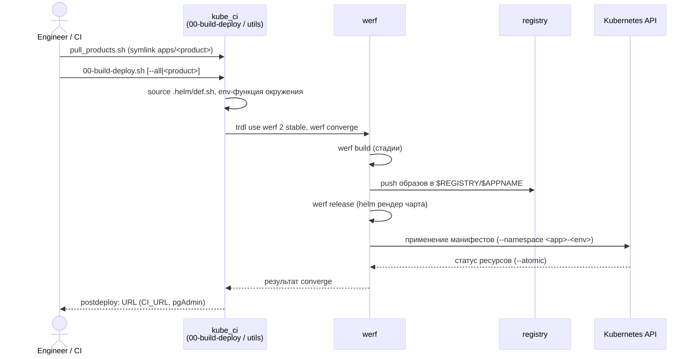

# Операции kube_ci

Контур `kube_ci` сведён к трём базовым операциям над уже развёрнутым кластером:
публикация (converge), откат (dismiss) и очистка (purge). Каждая запускается
одной командой из каталога окружения `kube_ci/dev/` или `kube_ci/prod/`; точки
входа окружения лишь подключают общие функции из
[`kube_ci/utils/`](../../kube_ci/utils/03-werf-converge.sh) и подмешивают
локальные `k8s_defs` и `productlist`. Эта статья описывает, что делает каждая
операция и какие скрипты за ней стоят. Пошаговые сценарии не дублируются -- они
в [runbook деплоя](../runbooks/deploy.md); модель окружений -- в
[dev-prod](dev-prod.md).

## Сводка

| Операция | Команда (из каталога окружения) | Библиотека |
|---|---|---|
| Публикация | `./pull_products.sh && ./00-build-deploy.sh [--all\|<product>]` | [`utils/03-werf-converge.sh`](../../kube_ci/utils/03-werf-converge.sh) |
| Откат | `./01-dissmiss.sh <product>\|--all` | [`utils/04-dissmiss.sh`](../../kube_ci/utils/04-dissmiss.sh) |
| Очистка | `./02-purge-stages.sh` | [`utils/05-purge-stages-local.sh`](../../kube_ci/utils/05-purge-stages-local.sh) |

Каждый файл `utils/*.sh` защищён от двойного выполнения проверкой
`[[ "${#BASH_SOURCE[@]}" -gt "1" ]] && return`, поэтому работает и как библиотека
(`source`), и как самостоятельный скрипт. Отличия этой копии оркестрации от
исходного `kube_ci` -- в [kube_ci/README.md](../../kube_ci/README.md).

## Публикация (converge)

Публикация состоит из двух шагов. Сначала
[`pull_products.sh`](../../kube_ci/dev/pull_products.sh) готовит продукты: создаёт
в каталоге окружения подкаталог `products/` и связывает в него каждый продукт из
`productlist` symlink'ом на `apps/<product>`. В демо исходники лежат в репозитории
рядом, поэтому вместо `git clone` -- symlink. В CI этот шаг заменяется
клонированием, см. [Подключение к GitLab CI](../integrations/gitlab-ci.md).

Затем [`00-build-deploy.sh`](../../kube_ci/dev/00-build-deploy.sh) выкатывает
продукты. Без аргументов или с `--all` он берёт все продукты из `productlist`,
иначе -- только перечисленные. Скрипт подключает библиотеку converge, читает
`productlist` и `k8s_defs`, экспортирует параметры кластера и для каждого
выбранного продукта заходит в его каталог и вызывает `deploy <env-функция>`.

Сам converge выполняет функция `deploy()` из
[`utils/03-werf-converge.sh`](../../kube_ci/utils/03-werf-converge.sh): активирует
werf через `trdl`, подключает контракт `.helm/def.sh`, вычисляет целевой
неймспейс `<NAMESPACE>-<ENVNAME>`, подхватывает `values-<ENVNAME>.yaml` и
`secrets-<ENVNAME>.yaml`, пробрасывает `CI_*`-переменные в helm и запускает `werf
converge` -- одной командой собирает образы, публикует их в реестр и применяет
релиз. Пошаговый разбор `deploy()` -- в
[Доставке в Kubernetes](../concepts/delivery-to-k8s.md). Тег образов несёт
единую версию продукта из файла `VERSION`, см. [Версионирование](versioning.md);
секреты окружения подмешиваются по ключу werf, см.
[Управление секретами](secrets.md).

Один запуск проходит так: инженер или CI вызывает `pull_products` и
`00-build-deploy`, контур читает контракт и передаёт управление werf, werf
собирает образы, кладёт их в registry, рендерит чарт и применяет манифесты через
Kubernetes API, после чего postdeploy печатает URL ресурсов.

## Откат (dismiss)

[`01-dissmiss.sh`](../../kube_ci/dev/01-dissmiss.sh) снимает релиз. Под капотом
[`utils/04-dissmiss.sh`](../../kube_ci/utils/04-dissmiss.sh) подключает контракт,
вызывает env-функцию и выполняет `werf dismiss --with-namespace` -- сносит релиз
вместе с его неймспейсом.

Скрипт требует явного аргумента: один или несколько ключей продуктов либо
`--all`. Без аргумента он отказывается работать и завершается с ошибкой -- иначе
обход `productlist` снял бы все продукты разом. Если переданный аргумент не
совпал ни с одним продуктом, скрипт тоже завершается с ошибкой и печатает список
доступных ключей. Эта защита особенно важна для prod, где откат -- точка
остановки (см. [dev-prod](dev-prod.md)).

## Очистка (purge)

[`02-purge-stages.sh`](../../kube_ci/dev/02-purge-stages.sh) сбрасывает локальный
кеш стадий сборки werf. Через
[`utils/05-purge-stages-local.sh`](../../kube_ci/utils/05-purge-stages-local.sh)
он вызывает `werf stages purge --stages-storage=:local` по каждому продукту из
`productlist`. Это освобождает место, а следующая сборка идёт с нуля. Очистка не
трогает развёрнутые релизы -- это операция над кешем сборщика, а не над
кластером.

Более жёсткий вариант -- [`utils/10-purge-werf-registry.sh`](../../kube_ci/utils/10-purge-werf-registry.sh):
он запускает `werf host cleanup` и `werf host purge` и удаляет docker-образы werf
по шаблонам `werf-images`, `werf-stages`, `werf-managed`. Этот скрипт не
привязан к окружению и работает по всему хосту сборки.

## Плюсы, минусы, безопасность

Плюсы. Весь жизненный цикл доставки сведён к трём командам с предсказуемым
поведением; логика вынесена в общие библиотеки и не дублируется между
окружениями.

Минусы. Откат и очистка `dismiss`/`purge` -- разрушающие операции; защита от
случайного запуска есть только у отката (обязательный аргумент), очистка кеша
выполняется без подтверждения.

Безопасность. Операции prod -- точка остановки, запускаются только с разрешения
оператора; общий для dev и prod кластер усиливает цену ошибки. Разбор рисков --
в [Компромиссах и безопасности схемы](../concepts/security-and-tradeoffs.md).

## Связанные статьи

- [Один контур, два окружения](dev-prod.md)
- [Управление секретами](secrets.md)
- [Версионирование](versioning.md)
- [Доставка в Kubernetes](../concepts/delivery-to-k8s.md)
- [Runbook деплоя](../runbooks/deploy.md)
- [kube_ci/README.md](../../kube_ci/README.md)
- [Подключение к GitLab CI](../integrations/gitlab-ci.md)
