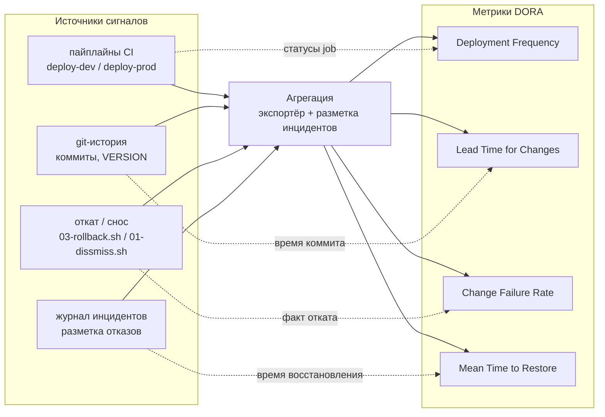

# Метрики DORA на этом контуре

Четыре метрики DORA измеряют поставку: как часто команда выкатывает изменения,
сколько времени проходит от коммита до прода, как часто выкатка ломает рабочую
систему и как быстро её чинят. Эта статья разбирает каждую метрику и показывает,
откуда на контуре `kube_ci` брать сигнал для её расчёта. Сразу оговорка: кода
сбора метрик в репозитории нет. Здесь описана концепция и точки съёма
сигналов на реальных артефактах -- пайплайнах CI, git-истории и фактах запуска
скриптов; реализацию (экспортёр, дашборд, хранилище) каждая команда строит под
свой стек. Сами операции, которые служат источником сигналов, разобраны в
[Операциях kube_ci](../delivery/kube-ci-operations.md).

## Deployment Frequency

Частота развёртываний -- сколько раз за период изменение доходит до окружения.
На контуре одно развёртывание -- это один результативный запуск
`00-build-deploy.sh`, обёрнутый в job CI. В [GitLab CI](gitlab-ci.md) сигнал
снимается с job-ов `deploy-dev` и `deploy-prod`, в [Jenkins](jenkins.md) -- со
stage'ей `Deploy dev` / `Deploy prod`. Считать по prod-окружению: каждый
`deploy-prod`, завершившийся без ошибок, -- одно развёртывание в проде. Метрика для dev отдельная
и обычно выше, потому что в dev катают чаще.

Источник сигнала -- статус и метка времени job: время старта, время завершения,
код возврата. CI-система хранит их в истории пайплайнов, и экспортёр читает их
через API (GitLab Jobs API, Jenkins REST API), не трогая сами скрипты `kube_ci`.

## Lead Time for Changes

Время от коммита до прода. Нижняя граница интервала -- момент коммита в git,
верхняя -- момент, когда `deploy-prod` отработал без ошибок. Связку коммита с развёртыванием на
контуре даёт версия: один скрипт раскатывает значение из файла `VERSION` по всем
артефактам продукта, и контракт `.helm/def.sh` отдаёт ту же версию как `CI_TAG`,
который становится тегом образов при выкатке -- см. [Версионирование](../delivery/versioning.md).
Тег образа в проде указывает на конкретную версию, версия привязана к коммиту,
где её зафиксировали, а время коммита берётся из git-истории.

Для расчёта нужны две метки: время git-коммита, поднявшего версию, и время job
`deploy-prod`, выкатившего образ с этим `CI_TAG`. Разница и есть lead time
изменения. Точность зависит от дисциплины версионирования: если несколько
коммитов выходят под одной версией, lead time считается до первого из них.

## Change Failure Rate

Доля развёртываний, после которых окружение пришлось чинить. Числитель --
развёртывания, повлёкшие откат или экстренное исправление; знаменатель -- все
развёртывания за период. На контуре прямой сигнал отказа -- запуск
`03-rollback.sh`: откат версии возвращает релиз на прошлую ревизию, и факт его
запуска вскоре после деплоя -- это признак неудачной выкатки. Дополнительные
сигналы -- повторный `deploy-prod` с поднятой patch-версией вскоре после
предыдущего (типичная картина hotfix) и запуск `01-dissmiss.sh` после деплоя.

Чистого автоматического сигнала «развёртывание сломало систему» в репозитории
нет: и `03-rollback.sh`, и `01-dissmiss.sh` запускают как при аварии, так и в
плановых сценариях, скрипт эти случаи не различает. Поэтому CFR на контуре
собирается с разметкой: запуски отката и hotfix-выкатки помечаются как инцидент
вручную или по журналу инцидентов, иначе метрика завысит число отказов.

## Mean Time to Restore

Среднее время восстановления после отказа. Начало интервала -- обнаружение
поломки (упавший job, алерт, заявка), конец -- момент, когда окружение снова
работает: повторный `deploy-prod` с исправлением, прошедший без ошибок, или
завершённый `03-rollback.sh` -- возврат релиза на предыдущую рабочую ревизию.
Сигналы -- те же метки времени job'ов CI и записи журнала инцидентов; репозиторий
даёт только нижний слой (факты запусков скриптов), верхний слой (когда заметили и
когда признали восстановленным) живёт в трекере инцидентов.

## Точки съёма сигналов

Сводно, контур отдаёт три источника, поверх которых строится сбор метрик:

- пайплайны CI -- статусы и метки времени job-ов `deploy-dev`/`deploy-prod`,
  `rollback`, читаемые через API CI-системы;
- git-история -- коммиты, поднявшие `VERSION`, и их время; связь с выкаткой через
  `CI_TAG`;
- факты запуска скриптов -- какой скрипт (`00-build-deploy.sh`, `03-rollback.sh`,
  `01-dissmiss.sh`) и с каким продуктом отработал, видно из лога job.

Ни одной из четырёх метрик репозиторий не считает сам. Реализация сводится к
экспортёру, который складывает эти сигналы и размечает инциденты; выбор стека за
командой.

Сигналы доходят до метрик так: пайплайны CI и git-история дают Deployment
Frequency и Lead Time; запуск отката и журнал инцидентов -- Change Failure Rate
и MTTR. Все источники проходят через слой агрегации, где запуски размечаются на
штатные и аварийные.

## Искажение от общего кластера

Один трейд-офф демо-схемы прямо бьёт по двум метрикам. dev и prod временно
указывают на один физический preprod-кластер и различаются только неймспейсом --
см. [Компромиссы и безопасность схемы](../concepts/security-and-tradeoffs.md),
раздел про общий preprod-кластер. Из-за этого Deployment Frequency прода трудно
отделить от dev: оба окружения катаются в тот же кластер, и без аккуратного
разделения по job'ам и неймспейсам частота прода завышается dev-выкатками. Change
Failure Rate искажается в ту же сторону: сбой в dev может задеть prod через общие
ресурсы кластера, и отказ запишется не тому окружению. При расчёте метрик
окружения разделяют строго по job'у CI (`deploy-dev` против `deploy-prod`), а не
по факту изменения в кластере. Когда появятся отдельные кластеры dev и prod,
искажение уходит само -- меняется только `KUBECONTEXT`/`REGISTRY` в `k8s_defs`.

## Плюсы, минусы, безопасность

Плюсы. Все четыре метрики DORA снимаются с готовых артефактов пайплайна --
job'ов публикации и отката, без отдельной инструментовки кода. Тонкая обёртка
`kube_ci` даёт ровно те события (выкатка, откат), на которых строятся частота
поставки, lead time, доля сбоев и время восстановления.

Минусы. Метрики настолько точны, насколько чисто размечены job'ы: без строгого
разделения окружений и продуктов сигналы смешиваются. Lead time и MTTR в демо
оцениваются по времени job'ов, а не по полному пути изменения, поэтому дают
нижнюю границу, а не абсолютную величину.

Безопасность. Общий preprod-кластер для dev и prod искажает Deployment Frequency
и Change Failure Rate -- сбой в dev может записаться prod'у. Это следствие
демо-послабления; разбор и смягчение -- в
[Компромиссах и безопасности схемы](../concepts/security-and-tradeoffs.md).

## Связанные статьи

- [Подключение к GitLab CI](gitlab-ci.md) -- job-ы, с которых снимаются сигналы.
- [Подключение к Jenkins](jenkins.md) -- те же сигналы в stage'ах Jenkins.
- [Операции kube_ci](../delivery/kube-ci-operations.md) -- публикация и откат как
  источники фактов поставки.
- [Версионирование](../delivery/versioning.md) -- связка коммита с выкаткой через
  `CI_TAG`, основа Lead Time.
- [Компромиссы и безопасность схемы](../concepts/security-and-tradeoffs.md) --
  общий кластер dev/prod и его влияние на метрики.
