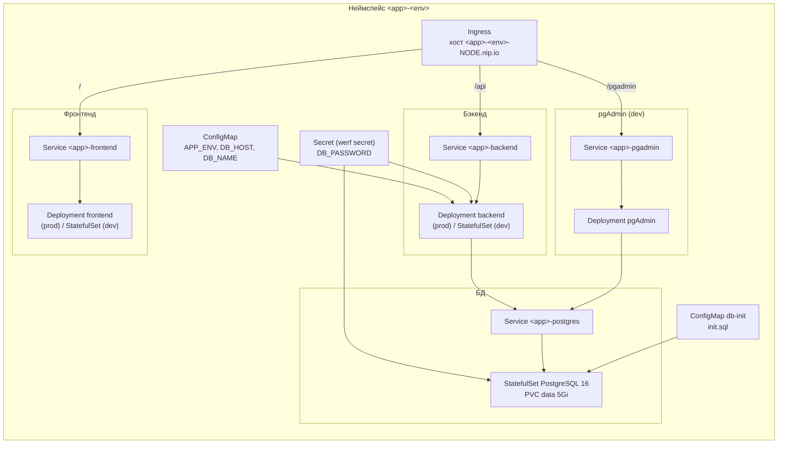

# Спецификации окружений и манифестов

Статья описывает, что именно `werf converge` создаёт в кластере на один продукт:
неймспейс окружения, набор Kubernetes-объектов из чарта, источник образов, выбор
ресурсов и различия между dev и prod. Требования к самому кластеру (registry,
ingress-nginx, insecure-доступ) вынесены в [requirements.md](requirements.md),
маршрутизация снаружи -- в [ingress.md](ingress.md).

Оба демо-продукта -- [`app1-java-react`](../../apps/app1-java-react/.helm/) (React +
Spring Boot) и [`app2-python-angular`](../../apps/app2-python-angular/.helm/) (Angular +
FastAPI) -- собраны по одному чарту с одинаковым набором шаблонов; различаются
именами объектов, образами и доменом. Бизнес-логика приложений демонстрационная.

## Неймспейс окружения

Неймспейс не хранится в чарте, а вычисляется при деплое. Контракт
[`.helm/def.sh`](../../apps/app1-java-react/.helm/def.sh) экспортирует `NAMESPACE`
(по умолчанию равен `APPNAME`) и `ENVNAME` (`dev` или `prod`). Скрипт
[`kube_ci/utils/03-werf-converge.sh`](../../kube_ci/utils/03-werf-converge.sh)
склеивает их в реальный неймспейс:

```bash
[ -z "$NAMESPACE" ] && NAMESPACE=$APPNAME
KUBE_NAMESPACE=${NAMESPACE}-${ENVNAME}
```

Так один кластер держит оба окружения каждого продукта в раздельных
неймспейсах: `app1-java-react-dev`, `app1-java-react-prod`,
`app2-python-angular-dev`, `app2-python-angular-prod`. Это и есть способ
поселить dev и prod на одном физическом кластере без коллизий имён. После
converge скрипт переключает текущий контекст kubectl на неймспейс продукта.

## Объекты чарта на продукт

Шаблоны лежат в [`apps/<app>/.helm/templates/`](../../apps/app1-java-react/.helm/templates/)
с числовым префиксом в имени файла -- он задаёт порядок чтения, не порядок
применения. Базовый набор:

| Файл шаблона | Объект | Назначение |
|---|---|---|
| `010-configmap.yaml` | ConfigMap | env приложения: `APP_ENV`, `DB_HOST`, `DB_PORT`, `DB_NAME`, `DB_USER` |
| `011-secret.yaml` | Secret | `DB_PASSWORD` (и пара pgAdmin, если включён) |
| `020-postgres.yaml` | Service + StatefulSet + PVC | PostgreSQL 16 с томом `data` (5Gi) |
| `021-db-init-configmap.yaml` | ConfigMap | `init.sql`, монтируется в `docker-entrypoint-initdb.d` |
| `030-backend-prod.yaml` | Service + Deployment | бэкенд в prod-форме (рендерится при `env != dev`) |
| `031-backend-dev.yaml` | Service + StatefulSet + PVC | бэкенд в dev-форме (рендерится при `env == dev`) |
| `040-frontend-prod.yaml` | Service + Deployment | фронт в prod-форме |
| `041-frontend-dev.yaml` | Service + StatefulSet + PVC | фронт в dev-форме |
| `050-pgadmin.yaml` | Service + Deployment | pgAdmin (при `pgadmin.enabled`) |
| `050a-pgadmin-configmap.yaml` | ConfigMap | `servers.json` с подключением к PostgreSQL |
| `100-ingress.yaml` | Ingress | внешний доступ, разобран в [ingress.md](ingress.md) |
| `001-dev-secret-ssh-key.yaml` | Secret | `id-rsa-vcs` для clone монорепо (только dev) |

Все объекты получают общие метки из [`_helpers.tpl`](../../apps/app1-java-react/.helm/templates/_helpers.tpl):
`app.kubernetes.io/name`, `part-of: werf-ci-demo`, `managed-by: werf`; внутри
продукта объекты различаются по метке `component` (postgres / backend / frontend
/ pgadmin).

Объекты внутри неймспейса продукта связаны так: единый Ingress раскладывает
трафик по пути на Service-ы фронта, бэкенда и pgAdmin; бэкенд и pgAdmin ходят в
PostgreSQL; ConfigMap и Secret отдают env бэкенду и базе, а ConfigMap db-init
подаёт первичную схему.



PostgreSQL всегда идёт StatefulSet с `volumeClaimTemplates` (том `data`,
`ReadWriteOnce`, storageClass `standard`) и readiness-пробой `pg_isready`. Пароль
БД берётся из Secret `<app>-secrets`; init-скрипт первичной схемы подаётся через
ConfigMap. Демо: пароль по умолчанию задан прямо в `values.yaml`, в боевом
контуре его место -- werf secret (см.
[../concepts/security-and-tradeoffs.md](../concepts/security-and-tradeoffs.md)).

## Различие dev и prod

Форма бэкенда и фронта переключается по `.Values.env`, поэтому из одного чарта
выходят два разных манифеста.

- prod (`030-backend-prod`, `040-frontend-prod`): Deployment с образом из
  [`werf.yaml`](../../apps/app1-java-react/werf.yaml) (`.Values.werf.image`),
  readiness/liveness-пробы на actuator-портах бэкенда, число реплик из
  [`values-prod.yaml`](../../apps/app1-java-react/.helm/values-prod.yaml)
  (бэкенд и фронт по 2). pgAdmin выключен.
- dev (`031-backend-dev`, `041-frontend-dev`): StatefulSet с одной репликой,
  два persistent-тома (`workspace`, `homeapp`), init-контейнер `prepare-dev-env`
  и смонтированный ssh-ключ `id-rsa-vcs`. ENTRYPOINT образа -- `sleep infinity`:
  под держится живым, разработчик заходит в него по VS Code Remote. pgAdmin
  включён ([`values-dev.yaml`](../../apps/app1-java-react/.helm/values-dev.yaml)).
  Подробнее режим разработки внутри кластера -- в
  [../delivery/dev-in-cluster.md](../delivery/dev-in-cluster.md).

Service бэкенда и фронта в обоих режимах называется одинаково
(`<app>-backend`, `<app>-frontend`), поэтому ingress и зависимости не зависят от
выбранной формы.

## Ресурсы

Демо-чарты не объявляют `requests`/`limits` на контейнерах -- поды планируются по
дефолтам кластера. Из persistent-ресурсов на продукт: том PostgreSQL 5Gi всегда,
плюс в dev два тома по 5Gi на каждый dev-под (`workspace`, `homeapp`). Размеры и
storageClass правятся в [`values.yaml`](../../apps/app1-java-react/.helm/values.yaml)
(ключи `postgres.*`, `dev.*`). Ориентир по кластеру в целом -- в
[requirements.md](requirements.md).

## Образы и registry

Образы prod-форм подставляются через `.Values.werf.image.<image>` -- werf сам
прокидывает в чарт адреса собранных образов. Регистром служит in-cluster registry
на хосте `registry-<NODE_IP>.nip.io` (фактическое значение `NODE_IP` --
в [`kube_ci/<env>/k8s_defs`](../../kube_ci/dev/k8s_defs)); converge публикует образы в
`$REGISTRY/$APPNAME` и тегирует их версией `CI_TAG` из файла
[`apps/<app>/VERSION`](../../apps/app1-java-react/VERSION). Postgres и pgAdmin
тянут публичные образы (`postgres:16`, `dpage/pgadmin4:8`) напрямую. Настройка
registry и insecure-доступа -- в [requirements.md](requirements.md);
версионирование тегов -- в [../delivery/versioning.md](../delivery/versioning.md).

## Плюсы, минусы, безопасность

Плюсы. Все объекты продукта (configmap, secret, postgres, backend/frontend в
dev- и prod-формах, pgAdmin, db-init-configmap, ingress) описаны одним чартом и
переключаются между окружениями значениями `values-<env>.yaml`, без отдельных
наборов манифестов. werf сам подставляет адреса собранных образов через
`.Values.werf.image`.

Минусы. dev и prod различаются формой объектов (dev-поды против prod-деплоев),
поэтому изменение, проверенное в dev, не покрывает автоматически prod-ветку
шаблона. Чарты не задают `requests`/`limits` -- ресурсная изоляция держится на
дефолтах кластера.

Безопасность. Образы публикуются в in-cluster registry на nip.io с
insecure-послаблениями, а `secret`-объект в демо хранит данные открыто. Разбор
послаблений registry и боевых альтернатив -- в
[Компромиссах и безопасности схемы](../concepts/security-and-tradeoffs.md).

## Связанные статьи

- [requirements.md](requirements.md) -- кластер, registry на nip.io,
  insecure-доступ, ресурсный ориентир.
- [ingress.md](ingress.md) -- как Ingress связывает хост nip.io с Service-ами
  фронта, бэкенда и pgAdmin.
- [../delivery/dev-in-cluster.md](../delivery/dev-in-cluster.md) -- dev-форма
  подов и работа внутри кластера.
- [../concepts/delivery-to-k8s.md](../concepts/delivery-to-k8s.md) -- весь поток
  converge от def.sh до объектов в кластере.
- [../runbooks/deploy.md](../runbooks/deploy.md) -- публикация, откат, очистка.
